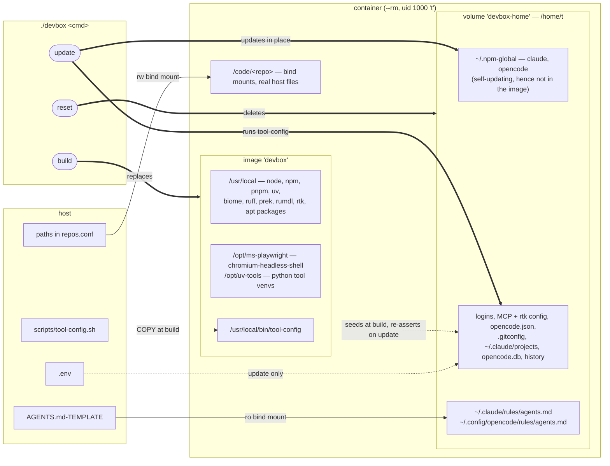

# Torben's DevBox

Container for coding, compiling and running coding agents with access to **only** the repos listed, no other local files

Entries in `repos.conf` are bind-mounted at `/code/`, so real host files.
After changes, just start the container again, no rebuild needed.

## Commands

```sh
./devbox
# straight into OpenCode
./devbox opencode
# one-off command
./devbox -- bash -lc 'uv run pytest'
# (re)build the image
./devbox build
# update opencode, claude, and tool-configs (rtk/ctx7)
./devbox update
# wipe container home: logins, sessions, history
./devbox reset
```

## Initialization

Nothing is baked in. Log in once inside; it lives in the `devbox-home` volume and survives rebuilds.

```sh
# Claude Code
claude
 /login

# OpenCode
opencode provider

# Context7
`CONTEXT7_KEY=` in `.env`
./devbox update
```

## Update

```sh
# agents in place, plus rtk/ctx7 config in the volume
./devbox update
# everything else; nothing is pinned, all resolve latest
./devbox build --no-cache --pull
```

Both build flags matter: plain `./devbox build` reuses the layer cache and updates nothing. A rebuild never touches the volume, so the agents and their seeded config update only via `./devbox update`.

## Layout

Three layers, three lifetimes: the image is rebuilt, the volume persists, the repos are the host's own files.



A rebuild never reseeds the volume: an existing `/home/t` wins, so anything the image bakes into the home dir reaches only a box whose volume does not exist yet. That is why the agents and their config update via `./devbox update`, and why everything meant to survive `./devbox reset` (browsers, CLI tools) lives in `/usr/local` or `/opt`.

## Adding packages

- No `sudo` inside
- Add apt packages to `apt-get install` list in the `Dockerfile`
- `./devbox build`
- Per-user installs need no rebuild and live in the home volume: `uv tool install <tool>`, `npm i -g <tool>`
- One-offs: `uvx <tool>`, `pnpm dlx <tool>`

## Working in the box and on the host

Both sides install into the same bind-mounted repo, but the host's dependencies are darwin
binaries and the box's are linux. Neither side has to reinstall after the other:

| | host | box |
| --- | --- | --- |
| python | `.venv/` | `.venv-box/` — `UV_PROJECT_ENVIRONMENT`, per repo, on disk next to `.venv` |
| node | `node_modules/` | volume `devbox-nm-<repo>-<path>`, mounted over each `node_modules` |

The venv is a second directory next to `.venv`, kept out of git by `~/.config/git/ignore` inside
the box (`./devbox update` writes it into an existing home volume).

The node side is one volume per `package.json` — not just the repo root, so pnpm workspaces
(`apps/*`) and repos holding several projects are covered too. The box sees its own
`node_modules`, the host's tree stays untouched underneath. New volumes are chowned to `t` in one
root container at startup: `devbox: preparing N node_modules volume(s)`.

Nothing is shared, so install once on each side (`pnpm install`, `uv sync`). Lockfiles still
cross — they are real files on the bind mount.

`./devbox reset` drops those volumes along with the home volume — reinstall inside afterwards.

## Ports

Nothing is published unless asked, so any number of boxes run side by side.
`--port` maps 1:1, same number inside and out, on `127.0.0.1` only — never the LAN.

```sh
./devbox --port 8500              # or --port=8500
./devbox --port 5173,5174,8500    # more than one: comma-separated, one flag
./devbox --port 5173 -- pnpm -C kaiser2 dev
```

Flags go before `--`. Two boxes asking for the same port: `devbox: port 8500 is already in use on this host` — give one of them another number, inside and out.

The server must bind `0.0.0.0` inside, not `localhost`:

- vite: `host: true` in `server` (set in every repo here); it ignores `HOST`
- streamlit: box sets `STREAMLIT_SERVER_ADDRESS=0.0.0.0`, which overrides `config.toml`
- nicegui: already binds `0.0.0.0`

The ports go into the container hostname, so the prompt and terminal tab name the box: `t@db-8501:/code$`.

Check the port logic after touching it: `./devbox selftest`

## AGENTS.md-TEMPLATE

Mounted read-only into each agent's rules directory.
Holds only my own conventions, no tools like rtk and Context7, ...
(`AGENTS.md` describes this repo instead and stays outside the box.)

```sh
~/.claude/rules/agents.md
~/.config/opencode/rules/agents.md
# via `instructions` in `opencode.json
```

## What the container can and cannot reach

Reachable: the repos in `repos.conf`, its home volume, the network (unrestricted).
Inbound: only the published ports above, and only from this host.

Not passed in: `~/.ssh`, `SSH_AUTH_SOCK`, `/var/run/docker.sock`, `GH_TOKEN`, provider keys such as `ANTHROPIC_API_KEY`, host environment, any path not in `repos.conf`.
No `sudo` — binary absent, `t` removed from the group.
Runs with `--cap-drop ALL --security-opt no-new-privileges`, so no path from uid 1000 up to root.

Git: `./devbox update` copies the host's `user.name` / `user.email` into the volume's `~/.gitconfig`, so commits carry the same author as on the host. Change your host identity — re-run it. No credentials, so `git push` fails by design — push from the host. Because the blast radius is the mounted repos, `--dangerously-skip-permissions` is defensible in here.

## Notes

- Runs as uid 1000 (`t`, renamed from the base image's `ubuntu`), matching the host user, so bind-mounted files keep sane ownership.
- **A rebuild never touches credentials or sessions.** All of `/home/t` is one volume and `--rm` drops the container, not the volume — opencode's sessions live in `~/.local/share/opencode/opencode.db`, Claude Code's in `~/.claude/projects/`, keyed by the container path so they stay separate from the host's. Only `./devbox reset` clears them, and it also drops the agents back to the image's baked-in version.

## Browser

`chromium-headless-shell` is baked into the image at `/opt/ms-playwright`
(`PLAYWRIGHT_BROWSERS_PATH`), so it survives `./devbox reset` and needs no per-repo download.
Install only the package in the repo; the browser is already there:

```sh
pnpm add -D @playwright/test
npx playwright test
```

Headless only — there is no display in here. A test that sets `channel: 'chromium'` (or any other
browser) wants a build that is not in the image:

```sh
# into the home volume, so it survives the container exiting
PLAYWRIGHT_BROWSERS_PATH=~/.cache/ms-playwright npx playwright install chromium
```

`/opt` is image, not volume — installing there instead is lost with the container. Needed every
time? Add it to the `Dockerfile` and rebuild.
